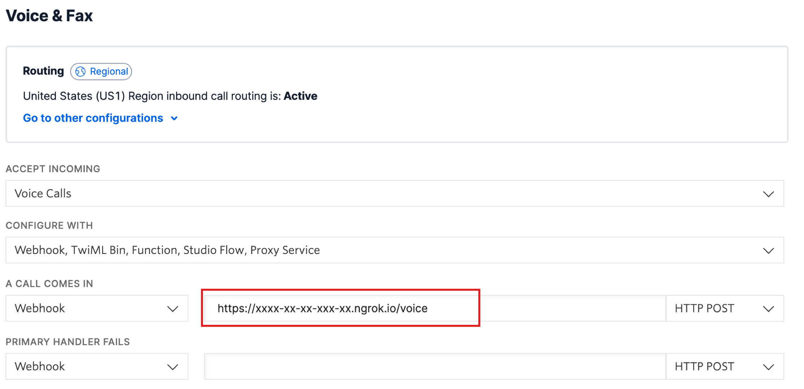

# Breaking Bad Quote Call
A Twilio application that plays Breaking Bad quotes when called

# Usage
Install packages with the command:
```
npm install
```

Create an `.env` file and add your Twilio api keys and number.

```angular2html
TWILIO_ACCOUNT_SID=<YOU_ACCOUNT_SID>
TWILIO_AUTH_TOKEN=<YOUR_AUTH_TOKEN>
TWILIO_NUMBER=<YOUR_GENERATED_TWILIO_NUMBER> # Ex. +14045555555
```

Start the server using the command:

```
node app.js
```

A ngrok url should print out like:

```angular2html
Connected to url: https://xxxx-xx-xx-xxx-xx.ngrok.io
```

Go to Twilio and attach the ngrok url to the incoming call webhook for your
Twilio number:



After saving, you're not able to call your Twilio number and hear Breaking Bad Quotes!!